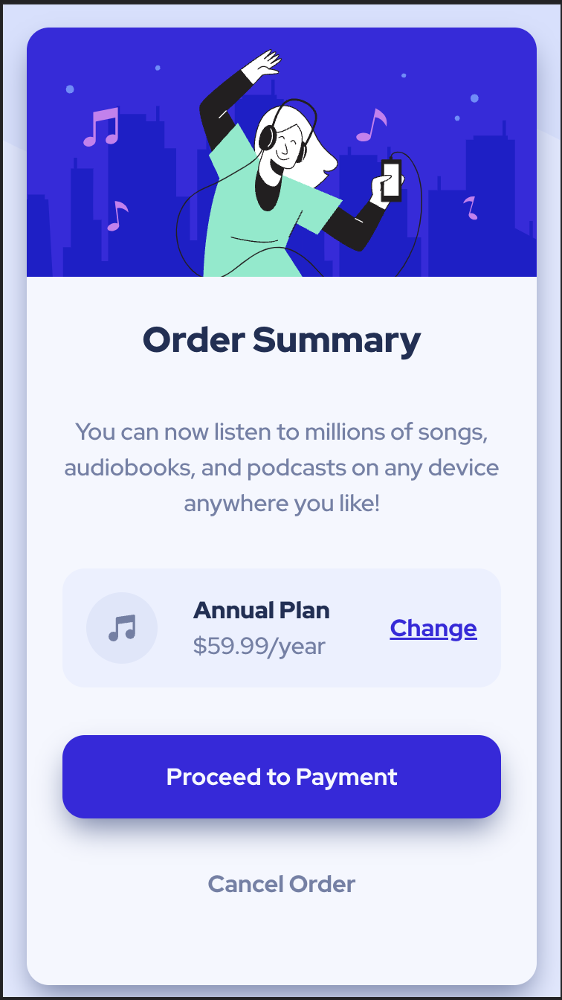

# Frontend Mentor - Product preview card component solution


This is a solution to the [Order summary card challenge on Frontend Mentor](https://www.frontendmentor.io/challenges/order-summary-component-QlPmajDUj). Frontend Mentor challenges help you improve your coding skills by building realistic projects. 

## Table of contents

- [Overview](#overview)
  - [The challenge](#the-challenge)
  - [Screenshot](#screenshot)
- [My process](#my-process)
  - [Final Version (images)](#final-version-images)
  - [Built with](#built-with)
  - [What I learned](#what-i-learned)
  - [Continued development](#continued-development)
- [Author](#author)


## Overview

### The challenge

Users should be able to:

- View the optimal layout depending on their device's screen size
- See hover and focus states for interactive elements

### Screenshot

Evidence for the completed project meeting the challenge requirements:

view the image of my solution following the directory below:

Desktop View 


Mobile View 


Check the code here:
<!-- Html -->

<!-- CSS -->


## My process
Similar to my previous project  
I started the Challenge by looking at the design, so that I can plan on properly setup my HTML semantic.
Learning from the previous challenge I started with the HTML Structure making sure I am using the proper syntax and grouping the necessary groups. 
After completing the HTML file, I then moved to setting up the CSS file using the *Global Reset* I previously learned.
I then styled each element from top to bottom, creating utilities and main component style as I went through. 
Since this is a single component to the page it was easy to make responsive using the max-width and choosing the appropriate width that it should be expand to.  

### Built with
This project was created using: 
- Semantic HTML5 markup
- CSS custom properties
- Flexbox
- CSS Grid

### What I learned

This project was to see if I can remember all the coding standards and practices that I previously learned from the **Preview Card** challenge. 
Implementing each method appropriately and to know how to use them in different situations. 

I also started implementing the BEM double underscore method to define the sub element of blocks, just to make my file easier to read and understand. 

```html
<article class="summary">
        <picture class="summary__img">

```

```css
/* Still using the Global Reset and configuration I learned from the previous project */

*, *::before, *::after{
    box-sizing: border-box;
    
}

*{
    margin: 0;
}

img,
picture,
svg{
    display: block;
    max-width: 100%;
}

/* A better structured  CSS pseudo-class */
:root{
    --primary-color:hsl(245, 75%, 52%);
    --secondary-color: hsl(225, 100%, 94%);

    /* Neutral */
    --blue-n-color100:hsl(225, 100%, 98%);
    --blue-n-color200:hsl(225, 100%, 96%);
    --blue-n-color300:hsl(225, 100%, 80%);
    --blue-n-color500: hsl(224, 23%, 55%);
    --blue-n-color700: hsl(259, 23%, 55%);
    --blue-n-color-800: hsl(223, 47%, 23%);

    /* Fonts */
    --ff-base: 'Red Hat Display', sans-serif;

    --fw-reg: 500;
    --fw-bold: 700;
    --fw-black: 900;

  /* Box Shadow */
  --box-shadow: 0 10px 20px -4px var(--blue-n-color500);
} 

```
### Continued development

#### Responsive Layout
I still need to practice more on creating mobile first and responsiveness of a site, since these are only small component. 

#### Coding Standards
I also need to look into some more information on best practices and methods when structuring my html and css.
  

## Author
- Frontend Mentor - [@timothy-joseph-collado](https://www.frontendmentor.io/profile/timothy-joseph-collado)
